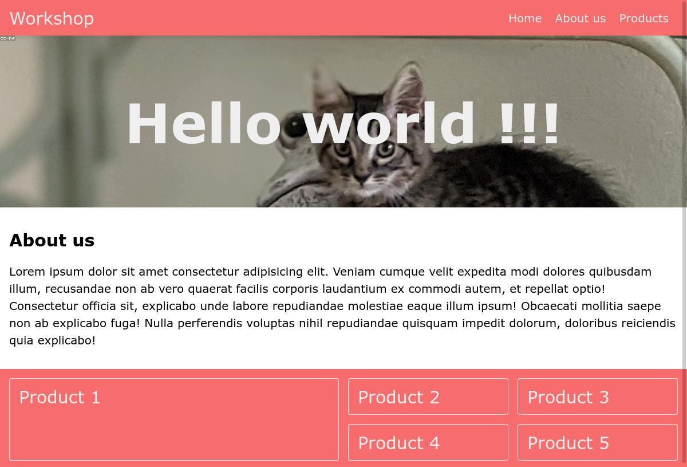

# Responsive design workshop 

## Initialisation
- In a new folder, create a *index.html* file.
- Open the file with your favorite IDE and add the HTML5 tags (html, head, body).
- Create a *style.css* file
- In the `<head>`, first add some mandatory tags as `<meta>` or `<title>`
  ```html
  <head>
    <meta charset="UTF-8">
    <meta name="viewport" content="width=device-width, initial-scale=1.0">
    <title>CSS Workshop</title>
  </head>
  ```
- Then add a `<link>` tag with the link to *style.css*
- In *index.html*, in the `<body>`, add a `<h1>` tag with the text 'Hello world !!!'
- In *style.css*, add the code 
  ```css
    h1 {
      color: #f76c6c; 
    }
   ```
- Open *index.html* in your browser, and check that you can read the message: 'Hello world !!!' in WCS pink.

Good job !


## Layout of your website
You will have to create a basic responsive website following the layout below (do not try to be pixel perfect, this image is a guide). 

 (The screenshot has been made at 1200px viewport width.)

> Hint : Browsers have default size for each HTML elements (margin, font-size, etc.). It is useful but sometimes you will prefer to reset some default behaviour. In this workshop, it could be interesting to remove margion on `<body>`. Furthermore, use `box-sizing: border-box` on each element will help you to deal element sizing (more info about [box-sizing](https://developer.mozilla.org/fr/docs/Web/CSS/box-sizing)).
>```css
* {
    box-sizing: border-box;
  }

  body {
    margin:0;
  }
``` 


### Navbar
- Try to reproduce the navbar. Start to create a `<nav>` tag and add the background color #f76c6c
- Then, analyse the navbar strucutre. You have a brand name at the left and a group of links at the right. Reproduce this using flexbox.
- Add some padding and color to improve the result 

> Reminder : [Video - Flexbox in 100s](https://www.youtube.com/watch?v=K74l26pE4YA)
> [Flexbox basics Cheatsheet](https://jonitrythall.com/content/images/flexboxsheet.pdf)

### Header
- Wrap your `<h1>` in a `<header>` tag and add a 300 height. 
- Add a background image (e.g a ramdon one on [loremflicker](https://loremflickr.com/1200/300))
- Center your main title (using flexbox) and change font size / color if necessary

> Hint: [Manage background size](https://developer.mozilla.org/fr/docs/Web/CSS/background-size)

### About us Section
- Add a `<section>` and a `<h2>` according to the template
- Add some fake text in a paragraph. Change font-size (20px), line-height (150%) and font-family (Verdana) to improve readability.
- Adjust margin / padding if necessary

### Products Section
- Using CSS grid, create a 4 columns / 2 rows layout.
- Add 5 products according to the template (first one will take 4 cells in the grid, others only one).
> Reminder : [CSS Grid basics in 5 minutes](https://www.freecodecamp.org/news/learn-css-grid-in-5-minutes-f582e87b1228)

## Make it responsive
You will add media queries and use CSS functions to obtain the responsive layout below at 360px (standard smartphone size). 
> You can use a breackpoint around 500px in your media queries, but focus on display at 360px for this workshop. Do not try for now to be perfectly responsive for each screen size.

 
(The screenshot has been made at 360px viewport width.)

- Make the navbar responsive by changing flex-direction for the menu items element.
- Use clamp to make your `<h1>` readable for each size.
- Modify the Grid template to adapt the products vertically, but still keep a largest "Product 1".
